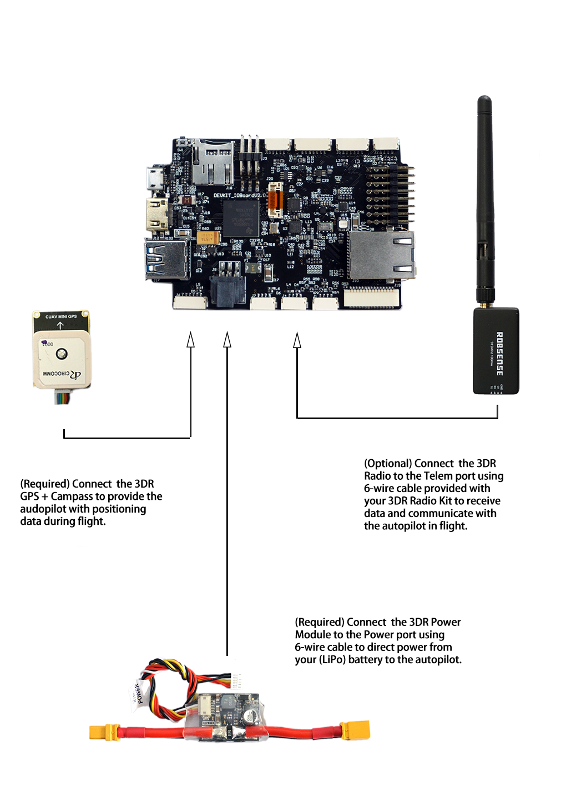
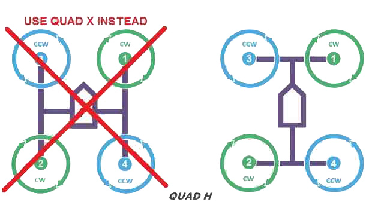
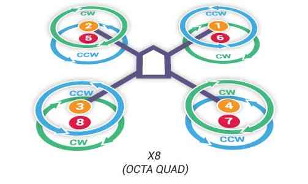
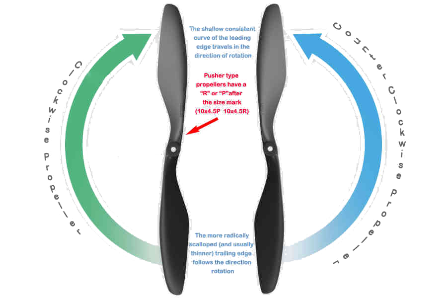
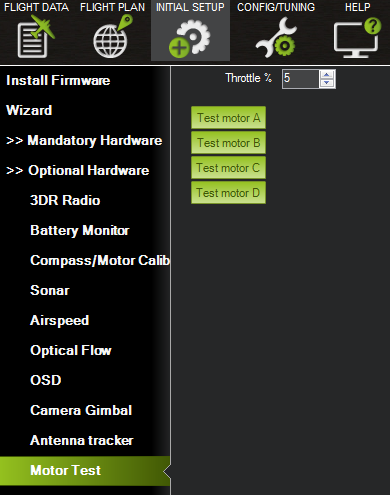
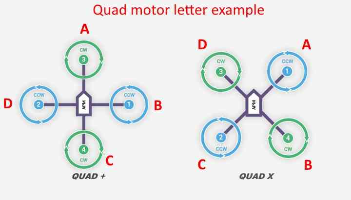

This section contains the instructions for assenbling the essential components of Copter on Phenix Pro Devkit (V1.0).

## Mounting the Flight Controller
This article explains how to mount the flight controller.

The Devkit board should be mounted with the white arrow pointing directly towards the front of the vehicle.

It should be placed close to the center of gravity of the vehicle (both horizontally and vertically). Generally this means it should be placed within a few centimeters of the middle of the vehicle and level with the motors. It is not critical that it is placed exactly at the middle but closer is better (there are no recorded cases of problems caused by the controller being far from the centre of gravity).

The board should be attached to the Anti-Vibration Platform using vibration dampening foam made by 3M.

> **Tip:**  
> Anti-Vibration Platform is a simple and effective mechanism for vibration control.

## Phenix Pro Devkit Wiring Method
This article provides high level information about how to power Phenix Pro Devkit and connect its most important peripheral.

> **Warning:**  
>  Do not connect any servos or other devices to the PWM outputs of your receiver. The RCIN port on the Devkit is designed for low power devices only, and a servo or relay may draw a lot of current from the receiver. If you connect a servo directly onto your receiver while the receiver is powered from the RCIN port of your Devkit you may damage your Devkit.

### Phenix Pro Devkit Wiring Chart

## Connect remote control inputs

* Pixhawk is compatible with
  1. PPM remote control (R/C) receivers
  2. Futaba S.Bus receivers
		
For traditional single-wire-per-channel (PWM) receivers a PPM encoder can be used to convert the receiver outputs to PPM-SUM.

 

## Connect ESCs and Motors
### Connect motor PWM signal outputs
This article explains how to connect the ESCs, Motors and Propellers.

Connect the power (+), ground (-), and signal (s) wires for each ESC to the controller main output pins by motor number. Find your frame type below to determine the assigned order of the motors.

> **Tip:**  
> Be sure you connect the ESC connector in the right way. Signal goes on the top of the rail (white or orange color wire) and ground at the bottom (black or brown color wire)

###Motor order diagrams

The sections below show motor order for each frame type (the numbers indicates the connected autopilot output pin) and the propeller direction (clockwise (CW) motors are shown in green and take pusher propellers,counterclockwise motors (CCW) are shown in blue and take puller propellers.

Use the diagram for your frame type, and wire the motors as shown.

### QUAD

### Hexa, Octo, Y6

MOTORS_Hexa-octo-y6.jpg

### X8

### Attach propellers
Find your frame in the motor order diagrams above. Clockwise motors are shown in green, marked CW, and take pusher propellers. Counterclockwise motors are shown in blue, marked CCW, and take puller propellers. Use the diagram for your frame type, and attach propellers to your vehicle as shown. For copters, attach propellers with the writing facing towards the sky. For more information on recognizing the different types of propellers, see the next section.  

### Recognizing clockwise and counterclockwise propellers
The diagrams above show two types of propellers: clockwise (called pushers) and counterclockwise (called pullers). Pusher propellers are often marked with a P. However not all propellers are marked and both types are often available in either rotational direction. Therefore, it is most reliable to recognize the correct propeller type by its shape as shown below. Note that the propellers below have the edge with the shallow consistent curve at the leading edge in direction of rotation and the more radical scalloped (and usually thinner edge) as the trailing edge. You can use these features to recognize propellers of the correct direction of rotation. 
prop_direction.png

### Checking the motor numbering with the Mission Planner Motor test
An alternative way to check that the motors have been hooked up correctly is to use the “Motors” test in the Mission Planner Initial Setup menu.

When connected to the vehicle via MAVLink, you can click on the green buttons shown above and the corresponding motor should spin for five seconds. Letters correspond to motor numbers as shown in the example below.

* Take off your props first!
* If no motors turn, raise the “Throttle %” to 10% and try again. If that doesn’t work, try 15%

The first motor to spin will be the one located directly forward in the case of + configuration, or the first motor to the right of straight forward in the case of X configuration. The motor test will then proceed in a clockwise rotation.

##Installing GPS Compass Module
### Connecting to Phenix Pro Devkit

Connect the GPS’s 6-pin GH connector to the Devkit’s “GPS” port.

### Mounting the GPS Module

This module permits the GPS to be mounted separately from the flight control module so that it can have the best clear (view) of the sky and allows the compass to be distanced from interfering magnetic fields.

>**Tip:**  
>The recommended orientation is to mount the module with the arrow facing toward the front of the vehicle and in the same direction as the arrow on the autopilot.

When mounting the GPS+Compass module:

* Place the module on the outside of your vehicle (in an elevated position if appropriate) with a clear view of the sky, as far as possible from the motors and ESCs, with the arrow facing forward.
* Distance the module from DC power wiring and the batteries by at least 10cm. Use of a GPS mast is highly recommended.
* Place the module clear of nearby iron containing metallic objects. (Use nylon or non magnetic stainless steel hardware and nylon or aluminum standoffs to mount the module).
* Twist power and ground wires where possible.

###Setup in Mission Planner
Compass Calibration in Mission Planner explains the simplest way to calibrate a compass mounted in the recommended orientation (arrows for autopilot and compass facing to front of vehicle).